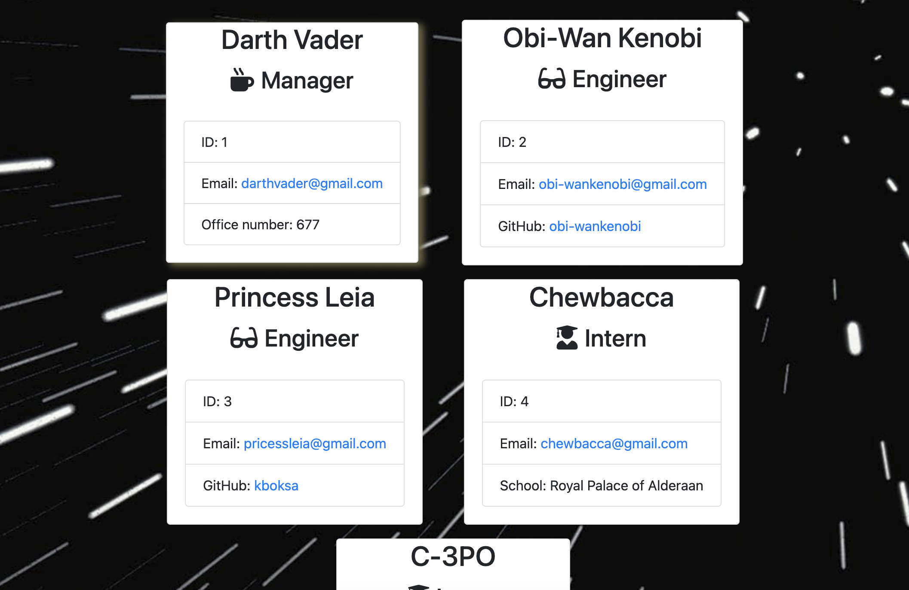

# <Team Profile Generator>

## Deployed link

https://kboksa.github.io/team-profile-generator/

## Description

Provide a short description explaining the what, why, and how of your project. Use the following questions as a guide:

- My motivation for this project was to create a website that shows the profile of the team.
- I build this project to give user a better idea of who is on their team and level.
- Builing this appication taught me how to test my code.

Below is a video of me showing how to use the application:

https://drive.google.com/file/d/119a9_Ap_fsRqgUwZp_nCmUARMGxnAD-5/view

## Installation

Download or clone repository
Node.js is required to run the application
npm install to install the required npm packages
npm i

## Usage

## Credits

Kalina Boksa
